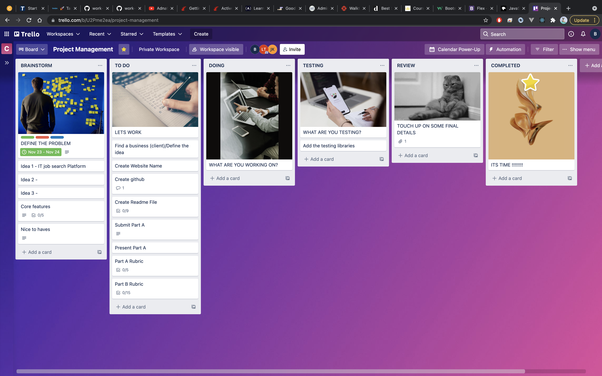
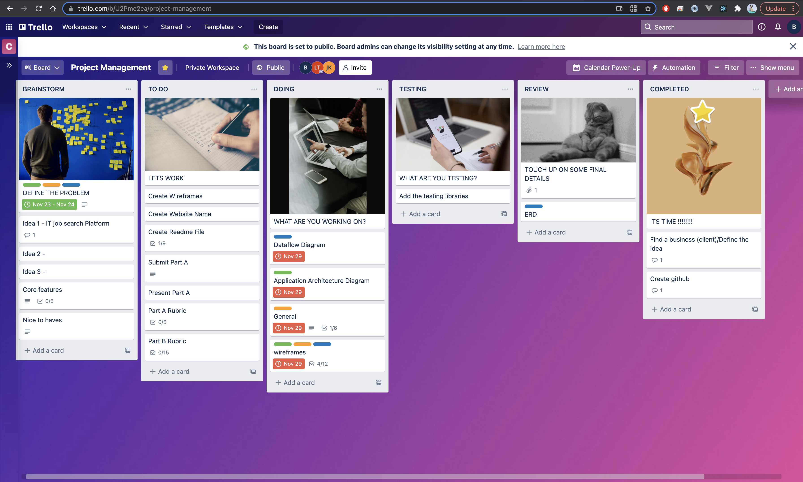
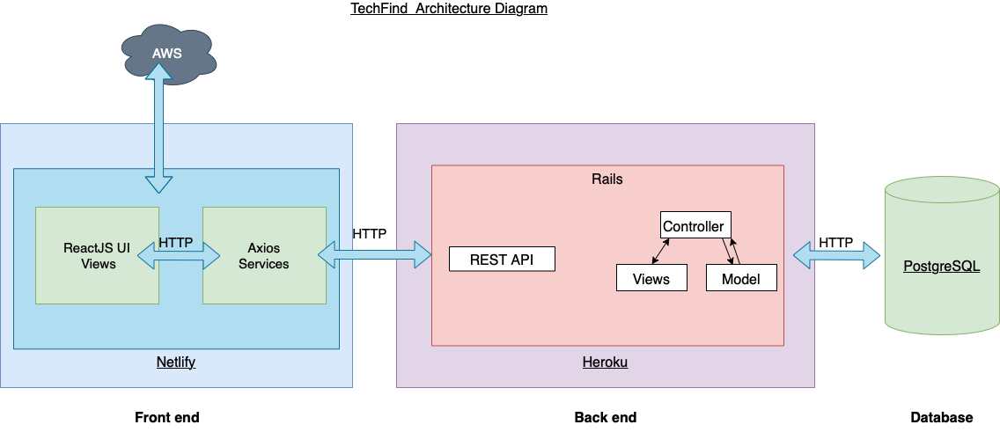
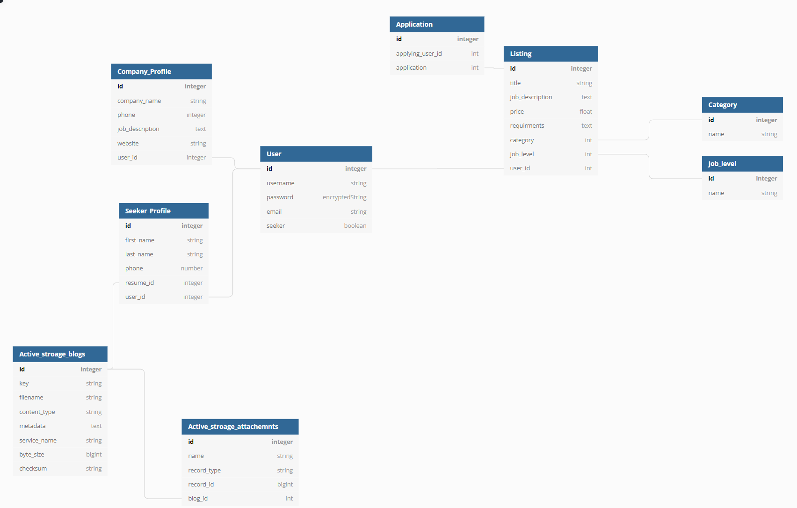
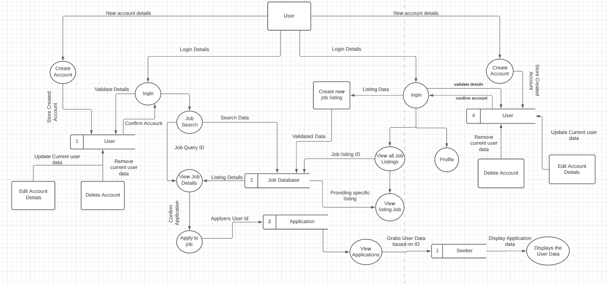

    
     

  <h2 align="center">TechFind</h2>
  <h3 align="center">Coder Academy Assignment 2A & 2B - Term 3</h3>
  

    <a href="https://github.com/BJB-Team/TechFind-Frontend">Link to Front-end Repository</a>
    ·
    <a href="https://github.com/BJB-Team/TechFind-Backend">Link to Back-end Repository</a>
    ·
    <a href="www.techfind.software">www.techfind.software</a>

  

---

## Table of Contents

<!-- TOC depthFrom:1 depthTo:4 withLinks:1 orderedList:0 -->

- [Table of Contents](#table-of-contents)
- [About the Project](#about-the-project)
  - [**Built With (Tech Stack)**](#built-with-tech-stack)
  - [**Statement of Purpose**](#statement-of-purpose)
  - [**Target Audience**](#target-audience)
  - [**Project Management**](#project-management)
  - [**Functionality / Features**](#functionality--features)
    - [**A Job Seeker Features**](#a-job-seeker-features)
    - [**A Job Poster Features**](#a-job-poster-features)
  - [**User Stories**](#user-stories)
    - [As a Seeker](#as-a-seeker)
    - [As a Poster](#as-a-poster)
  - [**Application Architecture Diagram**](#application-architecture-diagram)
  - [**Entity Relationship Diagram (ERD)**](#entity-relationship-diagram-erd)
  - [**Dataflow Diagram**](#dataflow-diagram)
  - [**Wireframes**](#wireframes)
  - [**Third Party Apps/Services**](#third-party-appsservices)
- [Roadmap](#roadmap)
- [Contributing](#contributing)
- [Authors](#authors)
- [Acknowledgments](#acknowledgments)

<!-- /TOC -->

## About the Project

### **Built With (Tech Stack)**

The core programming languages/frameworks/libraries used to build this application are:

### Ruby on Rails [Read Docs](https://guides.rubyonrails.org/getting_started.html)

Ruby on Rails was used to create the backend API that has data stored in it's accompanying Postgresql database. Ruby on Rails was chosen for it's simplicity to create a full stack application with little extra dependencies. In the Model, View and Controller (MVC) framework, Rails will handle the Model and the Controller actions. Essentially handling all the server side code when the client requires it.

### HTML5 [Read Docs (Not official)](https://developer.mozilla.org/en-US/docs/Web/HTML)

HTML provides the structure of every website. With the latest version HTML5 bringing easy to read semantic tagging with some client side validation within forms. HTML sites in every React component that's rendered as JSX.

### CSS3 [Read Docs (Not official)](https://developer.mozilla.org/en-US/docs/Web/CSS)

Cascading style sheets (CSS) is the framework for adding visual styles to the structure of our website. CSS libraries used for this project are Bootstrap and Styled Components. Bootstrap and Styled Component sit inside each React Component while minor amendments to these frameworks sits in a corresponding CSS file.

### JavaScript (ES6) [Read Docs](https://262.ecma-international.org/6.0/)

Javascript (& ES6) is the core functionality of the front-end part of this site. 

### ReactJS [Read Docs](https://reactjs.org/)

React is a Javascript library that uses component-based methodology this makes for easy single page applications and the reason React was the library used for this assignment. 

### Postgresql [Read Docs](https://www.postgresql.org/)

Postgresql

### **Statement of Purpose**

The purpose of the TechFind application is to link IT positions with candidates with those skills. Say goodbye to Junior Dev roles seeking 10 years experience in .NET roles. Each Job Poster can assign themselves to a company and create job advertisements to seek out potential employees.

### **Target Audience**

The target audience for this application are people in the technology industry looking for a job board that is specific to their industry.

### **Project Management**

To manage the team for this application a Trello board was set up to help follow an agile methodology. Each team member has been assigned different roles.

- Ben Aitcheson - Organising the documentation, front-end development and DevOps.

- Jack Kirkwood - Back-end development and Databases.

- Lukusa (Blaise) Tshitenga - User Experience/Interfacing, Graphic Design, Wire-framing and Architecture design.

This is the initial board. Everything from the marking rubric was thrown in and our feature design was started. Colours were chosen for each team member and roles were assigned.

As the deadline for Part A came close, exact roles were determined and delegated and moved into the doing column. Core features were decided upon first with secondary features coming under the 'nice the haves'.

The Trello board can be accessed publicly [here](https://trello.com/b/U2Pme2ea/project-management).

### **Project Management in the Post Mortem**

Following a Kanban style methodology the team set up a Trello board to delegate work. Column's in the board included Brainstorming, To Do, Doing, Testing, Review and Completed. 

Brainstorm: This part of the board was used to do all of the brainstorming. What features did we want and how we drilled down on the idea. It was also the place where we defined our core features and what was a nice to have feature.

To Do: All the ideas that came from our core features were created here initially. 

Kanban trello board. Each PR was done by one user then assigned a person to approve each commit and is then handed back to the initial PR person to squash and merge.

Wanted to try set up Continuous Integration 

ES-Linting 

Flow typechecking

This was kind of done with Netlify where we would stage and commit changes then Netlify would test these changes before they were pushed to production.

Now that the project is finished. 

### **Testing**

Talk about client testing here
### **Functionality / Features**

Here are some of the features that will be implemented for this application.

Users are split into Job Seekers and Job Posters.

#### **A Job Seeker Features**

A Seeker on sign up will require the user enter:

- Username
- First Name
- Last Name
- Email
- Password
- Phone Number
- Password Confirmation
- Resume

Each time the Seeker signs in they will go through the authentication process requiring a username/email and a password.

The Seeker can then search jobs by these options:

- Levels
- Job Categories

The Seeker can also make changes to their own profile once logged in.

#### **A Job Poster Features**

A Poster on sign up will require the user enter:

- Username / Company
- Email
- Password
- Password Confirmation
- Company Details (Website)

Each time the Poster signs in they will go through the authentication process requiring a username/email and a password.

The Poster can then post jobs by these options:

- Job description
- Location
- Level
- Job Category
- Salary / Wage (Not mandatory)

The Poster can also make changes to their own profile once logged in and view/modify applications made to their job posting.

A poster can view these about their applicants:

- View seekers email, phone number, resume
- Be able to approve/deny applications
- Sort applications into different levels

### **User Stories**

Here are some User Stories that we built this application from. Each stories outlines how the features will be built following agile methodologies.

#### As a Seeker

> “As a junior developer, I want to see what jobs candidates are posting, so that I can advance my career.”

> "As a job seeker, I can login with my email and a password, so that I have a unique identification."

> "As a job seeker, I can add some details like email or mobile, so that future employers can get in contact with me."

> "As a junior developer, I can search by job categories, so that I can find jobs specific to my ideal career."

> "As a job seeker, I can update and change my profile details, so that as my circumstances change I can stay up to date."

> "As a job seeker, I can upload my resume/CV, so that potential employers can download it when I apply for a job."

#### As a Poster

> “As a future hirer, I want to find the right candidates, so that I get the best people for the job.”

> "As a job poster, I can login with my email and password, so that I have a unique identification."

> "As a job poster, I can login under my company profile, so that seekers can see which company I work for."

> "As a company, I can add jobs to my company profile, so that I can show future prospects what jobs I am hiring for."

#### User Testing of Deployed Site and Production

Insert some stuff about the user running through the site

### **Application Architecture Diagram**

As you can see from the Architecture diagram below, this application will have the front-end deployed through Netlify. The views part of the MVC framework is handled by React. While the back-end will be on Heroku and will contain the Models and the Controller actions. Axios requests will send information between the two platforms creating a full stack application completely hosted on the cloud. 

### **Entity Relationship Diagram (ERD)**

Here's a simple diagram of how our database design will be implemented.

### **Dataflow Diagram**

The dataflow diagram shows how the data moves around the application. This one shows the data from the Seeker side (Left side) and the company/Job Poster side (Right side).

### **Wireframes**

Here are some high fidelity wireframes for the TechFind application in both Mobile and Desktop.

Initial Landing Page Desktop:

Initial Landing Page Tablet:

Initial Landing Page Mobile:

Company Profile Page Desktop:

Company Profile Editor Page Desktop:

Company Profile Editor Page Tablet:

Company Profile Editor Page Tablet:

Company Profile Page Mobile:

Create a Job Page Desktop:

Create a Job Page Tablet:

Create a Job Page Mobile:

Jobs/Applications Page Desktop:

Jobs/Applications Page Tablet:

Jobs/Applications Page Mobile:

Personal Account Page Desktop:

Personal Account Page Mobile:

Login Page Desktop:

Login Page Mobile:

Mobile Webpage Flow as a Seeker:

Mobile Webpage Flow as a Poster:

### **Third Party Apps/Services**

Here are the third party applications used for TechFinder, in no particular order:

- [Knock](https://github.com/nsarno/knock): A Ruby gem for creating user authentication. A quick alternative to creating authentication from scratch.
- [Heroku](https://www.heroku.com/): This is a cloud platform that lets the user build, deliver, monitor and scale applications. This means a user can host their full stack application on the internet for free. But for this application Heroku will take care of the backend.
- [Netlify](https://www.netlify.com/): This platform allows users to host their front end projects on the cloud for free with a 'freemium' plan. This platform will hold our React frontend as it requires less building than trying to deploy with Heroku.
- [GitHub](https://github.com/): An online platform for users to store public and private coding projects for free. This platform pairs with Heroku and Netlify. Github stores the code and Heroku provides the server to fetch the code and send it to the browser. It is also the platform that allow the team to store the code in a single repository and keeps track of all the git commits and merging.
- [Git](https://git-scm.com/): Version control software that is free. It helps the user keep track of changes allowing them to branch and rollback revisions.
- [Bootstrap 5](https://getbootstrap.com/): Bootstrap makes putting HTML and CSS together on the web browser simple. By streamlining the code required visually appealing layouts can be
- [Figma](https://figma.com/): This program allows users with little amount of graphic design skills to make mock versions of websites, business cards and other mock ups.
- [Trello](https://trello.com/): This is a project management tool used to keep track of features and items that need to be done. Our Trello board can be viewed [here](https://trello.com/b/U2Pme2ea/project-management).
- [Git Guardian](https://www.gitguardian.com/): This program scans the users GitHub account to ensure any passwords or keys aren't made public for someone to scrape and use for malicious activities.
- [DB Diagram.io](https://dbdiagram.io/home): A online platform used to give a visual display of the Entity Relationship Diagram for the back end on Find-A-Planner.
- [Visual Studio Code](https://code.visualstudio.com/): The most popular code editing software with plenty of extensions to help code this application. VS Code is owned by Microsoft and is free to use.

## Roadmap

In the future we would like to add ..

---

## Contributing

Contributions are what make the open source community such an amazing place to be learn, inspire, and create. Any contributions you make are appreciated.

1. Fork the Project
2. Create your Feature Branch (`git checkout -b YourBranchName`)
3. Commit your Changes (`git commit -m 'Add a feature/amendment'`)
4. Push to the Branch (`git push origin YourBranchName`)
5. Open a Pull Request

---

## Authors

- Ben Aitcheson - Organising the documentation and both front and back-end development. [Github](https://github.com/benaitcheson) / [Website](https://www.benaitcheson.me/)

- Jack Kirkwood - Back-end development and Databasing. [Github](https://github.com/jkirky82)

- Lukusa (Blaise) Tshitenga - Front-End development, Wireframing and Architecture design. [Github](https://github.com/Blaise122)

---

## Acknowledgments

- Thanks to the team at [Coder Academy](https://www.coderacademy.edu.au/) for their support.
